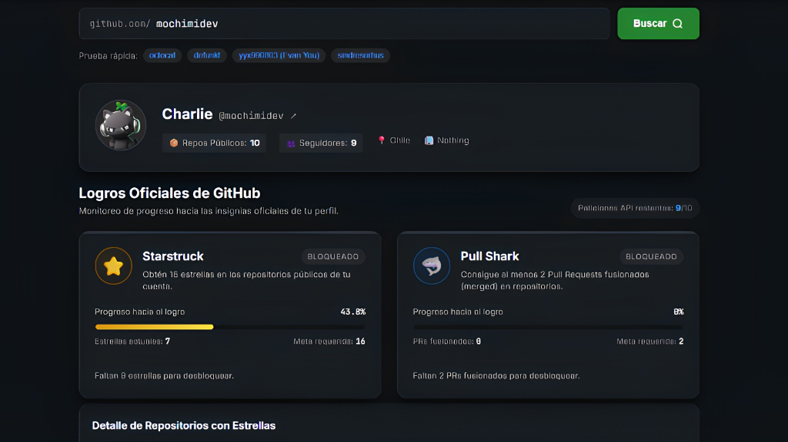

# 🦈 GitHub Badge Hunter

<p align="center">
  
</p>

<p align="center">
  <strong>Rastreador visual de logros oficiales de GitHub enfocado en Starstruck y Pull Shark.</strong><br>
  Construido con arquitectura modular y tecnología web nativa (HTML5, CSS3, ES Modules).
</p>

<p align="center">
  
  
  
  
  
</p>

---

## 🌟 Resumen del Proyecto

**GitHub Badge Hunter** permite a cualquier desarrollador introducir su nombre de usuario de GitHub para analizar su perfil en tiempo real contra los requisitos de los logros oficiales de la plataforma:

- ⭐ **Starstruck**: Mide las estrellas acumuladas en repositorios públicos contra la meta de **16 estrellas**.
- 🦈 **Pull Shark**: Rastrea la cantidad de Pull Requests fusionados (*merged*) contra la meta de **2 PRs**.

La aplicación calcula el progreso porcentual, muestra barras animadas, calcula cuánto falta para desbloquear cada insignia y proporciona un desglose de los repositorios que más aportan a la meta.

---

## ✨ Características Principales

- 🔍 **Buscador ágil**: Búsqueda inmediata con etiquetas de prueba rápida (`octocat`, `defunkt`, `yyx990803`, `sindresorhus`).
- 📊 **Cálculo preciso en tiempo real**: Porcentajes dinámicos, estrellas/PRs faltantes y estados visuales `BLOQUEADO` / `DESBLOQUEADO`.
- 📁 **Top Repositorios**: Lista detallada de los repositorios del usuario con mayor cantidad de estrellas.
- 🛡️ **Manejo inteligente de Rate Limits**:
  - Detección de límite excedido (HTTP 403) con hora exacta de restablecimiento de cuota.
  - Soporte integrado para **Personal Access Token (PAT)** para pasar de 60 a 5,000 peticiones por hora (almacenado únicamente en tu navegador vía `localStorage`).
- ⚠️ **Gestión amigable de errores**: Alertas visuales claras si el usuario no existe (HTTP 404) o si ocurre una falla de red.
- 🎨 **Estética Dark Mode**: Diseño moderno inspirado en la interfaz oscura de GitHub con efecto *glow* y diseño adaptable (*responsive*).
- ⚡ **Sin build step**: No requiere empaquetadores como Webpack ni dependencias pesadas de npm. Funciona de inmediato.

---

## 📐 Arquitectura del Sistema

El proyecto sigue una separación estricta de responsabilidades (*Separation of Concerns*):

```
github-badge-hunter/
├── index.html              # Estructura semántica, accesibilidad y contenedores
├── assets/
│   └── preview.png         # Captura de pantalla de la interfaz
├── css/
│   └── style.css           # Variables CSS, dark theme GitHub, componentes y responsive
├── js/
│   ├── api.js              # Cliente de la API de GitHub (fetch, auth, rate-limit headers)
│   ├── calculator.js       # Lógica matemática pura para metas y cálculo de porcentajes
│   ├── ui.js               # Renderizado del perfil, badges, barras de progreso y alertas
│   └── app.js              # Controlador principal y gestión de eventos
├── vercel.json             # Configuración para despliegue en Vercel
├── firebase.json           # Configuración para despliegue en Firebase Hosting
├── package.json            # Configuración de scripts locales
└── README.md               # Documentación del proyecto
```

---

## 🧮 Lógica de Negocio y Metas

| Logro | Meta Inicial | Endpoint GitHub | Lógica de Cálculo |
| :--- | :---: | :--- | :--- |
| **Starstruck** ⭐ | **16 estrellas** | `GET /users/{username}/repos` | $\text{Progreso} = \left(\frac{\text{Estrellas Totales}}{16}\right) \times 100$ |
| **Pull Shark** 🦈 | **2 PRs merged** | `GET /search/issues?q=type:pr+author:{username}+is:merged` | $\text{Progreso} = \left(\frac{\text{PRs Fusionados}}{2}\right) \times 100$ |

---

## 🚀 Inicio Rápido (Local)

Dado que la aplicación utiliza módulos nativos de JavaScript (`import`/`export`), debe servirse mediante un servidor HTTP local:

### Con Node.js (Recomendado):
```bash
# Iniciar servidor con el script de npm
npm start
```
*O con npx:*
```bash
npx serve . -l 3000
```

### Con Python:
```bash
python -m http.server 3000
```

Abre en tu navegador favorito: **[http://localhost:3000](http://localhost:3000)**

---

## ☁️ Despliegue en Producción

### Despliegue en Vercel
El archivo `vercel.json` ya se encuentra configurado:
```bash
# Con el CLI de Vercel
npx vercel --prod
```
O simplemente conecta tu repositorio de GitHub directamente en [Vercel](https://vercel.com).

### Despliegue en Firebase Hosting
El archivo `firebase.json` ya está preparado:
```bash
# Inicia sesión y despliega
npx firebase-tools login
npx firebase-tools deploy --only hosting
```

### Despliegue en GitHub Pages
1. Sube tu código al repositorio en GitHub.
2. Dirígete a **Settings > Pages**.
3. En **Build and deployment > Source**, selecciona **Deploy from a branch**.
4. Selecciona la rama `main` y la carpeta `/ (root)`.
5. ¡Listo! Tu sitio estará disponible en `https://<usuario>.github.io/<repo>/`.

---

## 📄 Licencia

Este proyecto está bajo la licencia MIT. Los nombres e insignias oficiales son marcas y propiedad intelectual de [GitHub, Inc.](https://github.com).
